This is an agent could find the gold in a wumpus world.
The basic method is truth-table enumeration-based entailment
(model checking).
In this code, enumerates all possible model by truth-table
and calculate the probability  of alpha is true.
If the probability  is 1, means alpha is True.
If the probability  is 0, means alpha is False.

If the agent finds the wumpus, it would shoot the wumpus.

All of the perceptions could contribute to the KB(Knowledge-Base) at the 
earliest time.

To accelerate this process( reduce both space complexity and time complexity),
this code also takes several measures:
    1) all of the perceptions would append corresponding elements to KB and 
    dicKB (which records the truth-table already determined, and checked in the 
    beginning of the method of model check) AMAP.
    2) symbol list only includes w(i,j) and p(i,j) since breeze and stench are 
    perceptions and would not be influenced by logic calculations.
    3) Only the grids in KB,dicKB and adjacent ones are added to symbol list.

All of the demands are satisfied. The agent could:
    1) find all of the 100% guguaranteed safe grids around current position.
    2) calculate probabilities of the grids around not 100% guaranteed safe.
    3) identify whether a location is safe at the earliest time possible 
    given percepts.
    4) not get killed because of step 2 above, and eventually find gold 
    and win the game if it is reachable.
    
The performance of the code: less than 1 second each round mostly.
    
According to the demands, this code could work well with the original wwsim.py.

In order to observe the result, a modified wwsim.py is also supplied 
though it isn't necessary.
(in the modified wwsim.py, a timer is added in nonGUI, and step counter and "autoRun" 
button are also added in GUI mode)

--------------------------------------------------------------------
wwagent.py was also modified from the original version written by Greg Scott, to do random motions so that this can be the base
of building various kinds of agent that work with the wwsim.py 
wumpus world simulation.

FACING KEY:
  0 = up
  1 = right
  2 = down
  3 = left

Actions
'move' 'grab' 'shoot' 'left' right'

<!--
 /* Font Definitions */
 @font-face
	{font-family:"Cambria Math";
	panose-1:2 4 5 3 5 4 6 3 2 4;
	mso-font-charset:0;
	mso-generic-font-family:roman;
	mso-font-pitch:variable;
	mso-font-signature:-536869121 1107305727 33554432 0 415 0;}
@font-face
	{font-family:"Arial Unicode MS";
	panose-1:2 11 6 4 2 2 2 2 2 4;
	mso-font-alt:Arial;
	mso-font-charset:0;
	mso-generic-font-family:auto;
	mso-font-pitch:auto;
	mso-font-signature:0 0 0 0 0 0;}
 /* Style Definitions */
 p.MsoNormal, li.MsoNormal, div.MsoNormal
	{mso-style-unhide:no;
	mso-style-qformat:yes;
	mso-style-parent:"";
	margin:0in;
	line-height:115%;
	mso-pagination:widow-orphan;
	font-size:11.0pt;
	font-family:"Arial",sans-serif;
	mso-fareast-font-family:Arial;
	mso-ansi-language:EN;}
h1
	{mso-style-priority:9;
	mso-style-unhide:no;
	mso-style-qformat:yes;
	mso-style-next:Normal;
	margin-top:20.0pt;
	margin-right:0in;
	margin-bottom:6.0pt;
	margin-left:0in;
	line-height:115%;
	mso-pagination:widow-orphan lines-together;
	page-break-after:avoid;
	mso-outline-level:1;
	font-size:20.0pt;
	font-family:"Arial",sans-serif;
	mso-font-kerning:0pt;
	mso-ansi-language:EN;
	font-weight:normal;}
h2
	{mso-style-priority:9;
	mso-style-qformat:yes;
	mso-style-next:Normal;
	margin-top:.25in;
	margin-right:0in;
	margin-bottom:6.0pt;
	margin-left:0in;
	line-height:115%;
	mso-pagination:widow-orphan lines-together;
	page-break-after:avoid;
	mso-outline-level:2;
	font-size:16.0pt;
	font-family:"Arial",sans-serif;
	mso-ansi-language:EN;
	font-weight:normal;}
h3
	{mso-style-noshow:yes;
	mso-style-priority:9;
	mso-style-qformat:yes;
	mso-style-next:Normal;
	margin-top:16.0pt;
	margin-right:0in;
	margin-bottom:4.0pt;
	margin-left:0in;
	line-height:115%;
	mso-pagination:widow-orphan lines-together;
	page-break-after:avoid;
	mso-outline-level:3;
	font-size:14.0pt;
	font-family:"Arial",sans-serif;
	color:#434343;
	mso-ansi-language:EN;
	font-weight:normal;}
h4
	{mso-style-noshow:yes;
	mso-style-priority:9;
	mso-style-qformat:yes;
	mso-style-next:Normal;
	margin-top:14.0pt;
	margin-right:0in;
	margin-bottom:4.0pt;
	margin-left:0in;
	line-height:115%;
	mso-pagination:widow-orphan lines-together;
	page-break-after:avoid;
	mso-outline-level:4;
	font-size:12.0pt;
	font-family:"Arial",sans-serif;
	color:#666666;
	mso-ansi-language:EN;
	font-weight:normal;}
h5
	{mso-style-noshow:yes;
	mso-style-priority:9;
	mso-style-qformat:yes;
	mso-style-next:Normal;
	margin-top:12.0pt;
	margin-right:0in;
	margin-bottom:4.0pt;
	margin-left:0in;
	line-height:115%;
	mso-pagination:widow-orphan lines-together;
	page-break-after:avoid;
	mso-outline-level:5;
	font-size:11.0pt;
	font-family:"Arial",sans-serif;
	color:#666666;
	mso-ansi-language:EN;
	font-weight:normal;}
h6
	{mso-style-noshow:yes;
	mso-style-priority:9;
	mso-style-qformat:yes;
	mso-style-next:Normal;
	margin-top:12.0pt;
	margin-right:0in;
	margin-bottom:4.0pt;
	margin-left:0in;
	line-height:115%;
	mso-pagination:widow-orphan lines-together;
	page-break-after:avoid;
	mso-outline-level:6;
	font-size:11.0pt;
	font-family:"Arial",sans-serif;
	color:#666666;
	mso-ansi-language:EN;
	font-weight:normal;
	font-style:italic;
	mso-bidi-font-style:normal;}
p.MsoTitle, li.MsoTitle, div.MsoTitle
	{mso-style-priority:10;
	mso-style-unhide:no;
	mso-style-qformat:yes;
	mso-style-next:Normal;
	margin-top:0in;
	margin-right:0in;
	margin-bottom:3.0pt;
	margin-left:0in;
	line-height:115%;
	mso-pagination:widow-orphan lines-together;
	page-break-after:avoid;
	font-size:26.0pt;
	font-family:"Arial",sans-serif;
	mso-fareast-font-family:Arial;
	mso-ansi-language:EN;}
p.MsoSubtitle, li.MsoSubtitle, div.MsoSubtitle
	{mso-style-priority:11;
	mso-style-unhide:no;
	mso-style-qformat:yes;
	mso-style-next:Normal;
	margin-top:0in;
	margin-right:0in;
	margin-bottom:16.0pt;
	margin-left:0in;
	line-height:115%;
	mso-pagination:widow-orphan lines-together;
	page-break-after:avoid;
	font-size:15.0pt;
	font-family:"Arial",sans-serif;
	mso-fareast-font-family:Arial;
	color:#666666;
	mso-ansi-language:EN;}
span.SpellE
	{mso-style-name:"";
	mso-spl-e:yes;}
span.GramE
	{mso-style-name:"";
	mso-gram-e:yes;}
.MsoChpDefault
	{mso-style-type:export-only;
	mso-default-props:yes;
	font-family:"Arial",sans-serif;
	mso-ascii-font-family:Arial;
	mso-fareast-font-family:Arial;
	mso-hansi-font-family:Arial;
	mso-bidi-font-family:Arial;
	mso-ansi-language:EN;}
.MsoPapDefault
	{mso-style-type:export-only;
	line-height:115%;}
 /* Page Definitions */
 @page
	{mso-footnote-separator:url("readme_images/header.htm") fs;
	mso-footnote-continuation-separator:url("readme_images/header.htm") fcs;
	mso-endnote-separator:url("readme_images/header.htm") es;
	mso-endnote-continuation-separator:url("readme_images/header.htm") ecs;}
@page WordSection1
	{size:8.5in 11.0in;
	margin:1.0in 1.0in 1.0in 1.0in;
	mso-header-margin:.5in;
	mso-footer-margin:.5in;
	mso-page-numbers:1;
	mso-footer:url("readme_images/header.htm") f1;
	mso-paper-source:0;}
div.WordSection1
	{page:WordSection1;}
-->
</style>
<!--[if gte mso 10]>

<![endif]--><!--[if gte mso 9]><xml>
 <o:shapedefaults v:ext="edit" spidmax="1026"/>
</xml><![endif]--><!--[if gte mso 9]><xml>
 <o:shapelayout v:ext="edit">
  <o:idmap v:ext="edit" data="1"/>
 </o:shapelayout></xml><![endif]-->
</head>

<body lang=EN-US style='tab-interval:.5in;word-wrap:break-word'>

<b style='mso-bidi-font-weight:normal'>Analysis of AI Agent of 
Wumpus Game<o:p></o:p></b>

 Chengpi Wu<o:p></o:p>

Dec 12, 2021

<h1>1.General Introduction</h1>

The objective of this code is to find the gold
in a wumpus world by the basic method of truth-table
enumeration-based entailment (model checking).

Before the agent moves, it checks all adjacent
grids and enumerates all possible models by truth-table and calculates the
probability of alpha is true where alpha is w(i,j) and p(i,j) that means
there is a wumpus or a pit.

If the probability is 1, means alpha is True ( or entailed by KB ).

If the probability is 0, means alpha is False ( or not alpha entailed by KB ).

If the agent finds the wumpus,
it would shoot and kill the wumpus (
Figure 1).

The results have been verified manually.

All of the demands are satisfied. The agent
could:

1) find all of the 100% guaranteed safe grids
around the current position.

2) calculate probabilities of the grids around
not 100% guaranteed safe.

3) identify whether a location is safe at the
earliest time possible given percepts.

4) not get killed because of step 2 above, and
eventually find gold and win the game if it is reachable.

Figure 1 The rational agent kills wumpus and grab the gold

<!--[if gte vml 1]><v:shapetype
 id="_x0000_t75" coordsize="21600,21600" o:spt="75" o:preferrelative="t"
 path="m@4@5l@4@11@9@11@9@5xe" filled="f" stroked="f">
 <v:stroke joinstyle="miter"/>
 <v:formulas>
  <v:f eqn="if lineDrawn pixelLineWidth 0"/>
  <v:f eqn="sum @0 1 0"/>
  <v:f eqn="sum 0 0 @1"/>
  <v:f eqn="prod @2 1 2"/>
  <v:f eqn="prod @3 21600 pixelWidth"/>
  <v:f eqn="prod @3 21600 pixelHeight"/>
  <v:f eqn="sum @0 0 1"/>
  <v:f eqn="prod @6 1 2"/>
  <v:f eqn="prod @7 21600 pixelWidth"/>
  <v:f eqn="sum @8 21600 0"/>
  <v:f eqn="prod @7 21600 pixelHeight"/>
  <v:f eqn="sum @10 21600 0"/>
 </v:formulas>
 <v:path o:extrusionok="f" gradientshapeok="t" o:connecttype="rect"/>
 <o:lock v:ext="edit" aspectratio="t"/>
</v:shapetype><v:shape id="image17.png" o:spid="_x0000_i1046" type="#_x0000_t75"
 style='width:271.2pt;height:207.6pt;visibility:visible;mso-wrap-style:square'>
 <v:imagedata src="readme_images/image001.png" o:title=""/>
</v:shape><![endif]--><![if !vml]>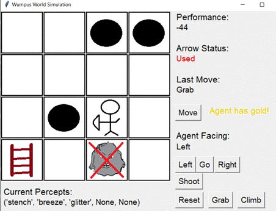<![endif]>

<h1>2. Methods and Added Parts</h1>

<o:p>&nbsp;</o:p>

To accelerate this process(
reduce both space complexity and time complexity), this code takes
several measures:

1) all of the perceptions would append
corresponding elements to KB and dicKB (which is a
dictionary records the truth-table already determined, like  [(w03,True) or (p03,False)], and
checked in the beginning of the method of modelCheck())
AMAP.

All of the perceptions could contribute to the
KB (Knowledge-Base) at the earliest time.

For example, if the agent is located at (0,3),
and if 'breeze' is in percepts, [“p02”,”or”,”p13”]
would be added to KB.

2) symbols list only includes w(i,j) and p(i,j)
since breeze and stench are perceptions and would not be influenced by logic
calculations. 

3) Only the grids in KB,dicKB and adjacent ones are added to symbols list.

Improved by several measures, the code could
end in less than 1 second in a 4*4 wumpus world in
most scenarios(Figure 2).

<o:p>&nbsp;</o:p>

Figure 2 Timer of the code

<!--[if gte vml 1]><v:shape
 id="image6.png" o:spid="_x0000_i1045" type="#_x0000_t75" style='width:173.4pt;
 height:2in;visibility:visible;mso-wrap-style:square'>
 <v:imagedata src="readme_images/image003.png" o:title=""/>
</v:shape><![endif]--><![if !vml]>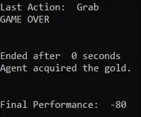<![endif]>

<o:p>&nbsp;</o:p>

To do these works, some new attributes and methods
are added.

<h2>2.1 Attributes</h2>

KB: knowledge base

dicKB: a dictionary of verified truth, like ('w03',False),('p03',False)

nextfacing: the goal facing that the agent need to turn

nextpos: the next position that the agent want to
move

numTrueKB: counter of True value of KB, used to calculate the probability

numTrueAlpha: counter of True value of KB, used to calculate the probability

symbolsList:  a list includes all necessary
symbols

wumpusGrid: the position of wumpus

wumpusAlive: check whether wumpus died, initial value is
True

visitedGrids: a list records grids already visited

step: counter of steps

<h2>2.2 Methods Introduction</h2>

isTrue(): 

<b style='mso-bidi-font-weight:normal'>Function:
</b>same as the breakout exercise in the class

<o:p>&nbsp;</o:p>

checkDicKB(): 

<b style='mso-bidi-font-weight:normal'>Function:
</b>check whether the (alpha,True) or (alpha,False)
already in the dictionary dicKB

<o:p>&nbsp;</o:p>

modelCheck(self,symbols,model,KB,alpha,dicKB):

<b style='mso-bidi-font-weight:normal'>Function:
</b>emulate the true-value table, check whether alpha is
True when KB is True based on model. Count the number of the True-value of
alpha and KB for the calculation of probabilities later.

Recalled by modelCheck
().

<b>The pseudo code of action()
is below :<o:p></o:p></b>

<o:p>&nbsp;</o:p>

<i style='mso-bidi-font-style:normal'>If symbols list is empty:<o:p></o:p></i>

<i style='mso-bidi-font-style:normal'>            If isTrue(KB,model):<o:p></o:p></i>

<i style='mso-bidi-font-style:normal'>                        numTrueKB ++<o:p></o:p></i>

<i style='mso-bidi-font-style:normal'>                        if
isTrue(alpha,mode)<o:p></o:p></i>

<i style='mso-bidi-font-style:normal'>                                    numTrueAlpha++<o:p></o:p></i>

<i style='mso-bidi-font-style:normal'>            else:<o:p></o:p></i>

<i style='mso-bidi-font-style:normal'>                        return
True<o:p></o:p></i>

<i style='mso-bidi-font-style:normal'>else:<o:p></o:p></i>

<i style='mso-bidi-font-style:normal'>            p &lt;-
first symbol from symbols list<o:p></o:p></i>

<i style='mso-bidi-font-style:normal'>            if (p,True) in self.dicKB:<o:p></o:p></i>

<i style='mso-bidi-font-style:normal'>                        return
modelCheck(rest,model+[(p,True)], KB,alpha, dicKB)<o:p></o:p></i>

<i style='mso-bidi-font-style:normal'>            elif (p,False)
in self.dicKB:<o:p></o:p></i>

<i style='mso-bidi-font-style:normal'>               
return modelCheck(rest,model+[(p,False)], KB,alpha, dicKB)<o:p></o:p></i>

<i style='mso-bidi-font-style:normal'>            else:<o:p></o:p></i>

<i style='mso-bidi-font-style:normal'>                firstPart = modelCheck(rest,model+[(p,True)],KB,alpha,dicKB) <o:p></o:p></i>

<i style='mso-bidi-font-style:normal'>                secondPart = modelCheck(rest,model+[(p,False)],KB,alpha,dicKB)<o:p></o:p></i>

<i style='mso-bidi-font-style:normal'>               
return firstPart and secondPart<o:p></o:p></i>

<i style='mso-bidi-font-style:normal'><o:p>&nbsp;</o:p></i>

<o:p>&nbsp;</o:p>

more truth added to dicKB,
more time complexity and space complexity be reduced.

Probability of alpha (under dicKB,KB) = numTrueAlpha
/ numTrueKB

<o:p>&nbsp;</o:p>

update(self, percept):

<b style='mso-bidi-font-weight:normal'>Function:
</b>Original code is modified. 

According to the latest perceptions, the agent
updates KB &amp; dicKB.

(original attribute of map removed in the
code)

<o:p>&nbsp;</o:p>

calculateNextPosition(self):

<b style='mso-bidi-font-weight:normal'>Function:
</b>Predict what location it is in based on the direction
it was facing when it move.

( maintain the original code unchanged)

<o:p>&nbsp;</o:p>

calculateNextDirection(self,action):

<b style='mso-bidi-font-weight:normal'>Function:
</b>the direction the agent is facing needs to be
calculated based on whether the agent turned left/right and what direction it
was facing when it did

( maintain the original code unchanged)

<o:p>&nbsp;</o:p>

collectGrids(self,complexList):

<b style='mso-bidi-font-weight:normal'>Function:
</b>collect Grids from (KB) as symbols

<o:p>&nbsp;</o:p>

extractGrids(self,complexList):

<b style='mso-bidi-font-weight:normal'>Function:
</b>extract Grids from (dicKB)
as symbols

<o:p>&nbsp;</o:p>

symbolCreateList(self,r,c): 

<b style='mso-bidi-font-weight:normal'>Function:
</b>create local symbols of adjacent grids and current
grid.

<o:p>&nbsp;</o:p>

calculateProb(self,r,c,alpha):

<b style='mso-bidi-font-weight:normal'>Function:
</b>generate probability of alpha by recalling modelCheck().

Recalled by trygrid(self,r,c).

<o:p>&nbsp;</o:p>

trygrid(self,r,c):

<b style='mso-bidi-font-weight:normal'>Function:
</b>check whether a grid is safe,return it to safeList,failList,probList
correspondingly. if it's not sure whether it's safe or a pit or wumpus, calculates the sum of prob(wumpus &amp; pit) by recalling calculateProb().

( the failList is used to debug and unnecessary at
last )

<o:p>&nbsp;</o:p>

try4grids(self,r,c):

<b style='mso-bidi-font-weight:normal'>Function:
</b>Check whether the 4 adjacent grids are safe.

<o:p>&nbsp;</o:p>

calculateAction(self):

<b style='mso-bidi-font-weight:normal'>Function:
</b>calculate the turn action according to current and
next facing.

<o:p>&nbsp;</o:p>

action(self):

<b style='mso-bidi-font-weight:normal'>Function:
</b>this is the function that will pick the next action of
the agent.

<b>The pseudo code of action()
is below :<o:p></o:p></b>

<o:p>&nbsp;</o:p>

<i style='mso-bidi-font-style:normal'>step+=1<o:p></o:p></i>

<i style='mso-bidi-font-style:normal'>If the last action is turn direction and reaches goal
facing:<o:p></o:p></i>

<i style='mso-bidi-font-style:normal'>            If face
the wumpus<o:p></o:p></i>

<i
style='mso-bidi-font-style:normal'>shoot <o:p></o:p></i>

<i style='mso-bidi-font-style:normal'>If face a goal position<o:p></o:p></i>

<i
style='mso-bidi-font-style:normal'>move<o:p></o:p></i>

<i style='mso-bidi-font-style:normal'>Return<o:p></o:p></i>

<i style='mso-bidi-font-style:normal'>else</i><i
style='mso-bidi-font-style:normal'>：<o:p></o:p></i>

<i style='mso-bidi-font-style:normal'>            Turn
direction continuously<o:p></o:p></i>

<i style='mso-bidi-font-style:normal'>Return<o:p></o:p></i>

<i style='mso-bidi-font-style:normal'><o:p>&nbsp;</o:p></i>

<i style='mso-bidi-font-style:normal'>If the agent won:<o:p></o:p></i>

<i style='mso-bidi-font-style:normal'>            Action =
Exit<o:p></o:p></i>

<i style='mso-bidi-font-style:normal'>return<o:p></o:p></i>

<i style='mso-bidi-font-style:normal'><o:p>&nbsp;</o:p></i>

<i style='mso-bidi-font-style:normal'>If  the</i><i
style='mso-bidi-font-style:normal'> agent
percept glitter:<o:p></o:p></i>

<i style='mso-bidi-font-style:normal'>            Action =
Grab<o:p></o:p></i>

<i style='mso-bidi-font-style:normal'>return<o:p></o:p></i>

<i style='mso-bidi-font-style:normal'><o:p>&nbsp;</o:p></i>

<i style='mso-bidi-font-style:normal'>If a grid in possible safe grids list and belong to
visited grids list:<o:p></o:p></i>

<i style='mso-bidi-font-style:normal'>            Move to
safe grids list<o:p></o:p></i>

<i style='mso-bidi-font-style:normal'><o:p>&nbsp;</o:p></i>

<i style='mso-bidi-font-style:normal'>If find wumpus:<o:p></o:p></i>

<i style='mso-bidi-font-style:normal'>            If face
it: <o:p></o:p></i>

<i style='mso-bidi-font-style:normal'>            Action
= ‘shoot’<o:p></o:p></i>

<i style='mso-bidi-font-style:normal'>Else:<o:p></o:p></i>

<i style='mso-bidi-font-style:normal'>            Action
= turn direction<o:p></o:p></i>

<i style='mso-bidi-font-style:normal'><o:p>&nbsp;</o:p></i>

<i style='mso-bidi-font-style:normal'>Search unvisited grid in safe grid list and select
randomly:<o:p></o:p></i>

<i style='mso-bidi-font-style:normal'>            If all
grids have been visited:<o:p></o:p></i>

<i style='mso-bidi-font-style:normal'>                        Jump
out to possible safe grids list with a probability ( default
value is 20%)<o:p></o:p></i>

<i style='mso-bidi-font-style:normal'>            Else:<o:p></o:p></i>

<i style='mso-bidi-font-style:normal'>                        Choose
one unvisited safe grid randomly<o:p></o:p></i>

<i style='mso-bidi-font-style:normal'><o:p>&nbsp;</o:p></i>

<i style='mso-bidi-font-style:normal'>If safe grids list is null or jumped out of it with a
probability:<o:p></o:p></i>

<i style='mso-bidi-font-style:normal'>            Sort
possible safe grids list by probabilities<o:p></o:p></i>

<i style='mso-bidi-font-style:normal'>            if there
are more than 1 grid has the least value(least risky):
<o:p></o:p></i>

<i
style='mso-bidi-font-style:normal'>Choose
one grid randomly<o:p></o:p></i>

<i style='mso-bidi-font-style:normal'>Else:<o:p></o:p></i>

<i style='mso-bidi-font-style:normal'>            Choose
it<o:p></o:p></i>

<i style='mso-bidi-font-style:normal'><o:p>&nbsp;</o:p></i>

<i style='mso-bidi-font-style:normal'>Return action<o:p></o:p></i>

<h1>3. Results</h1>

To compare the two agents of rational agent
(marked as “smart” in the code)  and random agent, 10 groups are
established. The results show that in most scenarios the rational agent is much
better (Table 1). In the 10 groups, the rational agent grabs gold for 7 times,
falls in pits for 3 times, the random agent is eaten by wumpus
for 1 time, grabs gold for 1 time, and falls in pits for 8 times.

However, in some scenarios both agents fail
(group 3,8,9). Because the rational agent could go more steps, which means the
performance score is smaller (Absolute value of the negative number is bigger) ( group 3,8 ). That’s inevitable. 

<o:p>&nbsp;</o:p>

Table 1  The results of 10 contrast groups

<table class=a border=1 cellspacing=0 cellpadding=0 width=623 style='border-collapse:
 collapse;mso-table-layout-alt:fixed;border:none;mso-border-alt:solid black 1.0pt;
 mso-yfti-tbllook:1536;mso-padding-alt:5.0pt 5.0pt 5.0pt 5.0pt;mso-border-insideh:
 1.0pt solid black;mso-border-insidev:1.0pt solid black'>
 <tr style='mso-yfti-irow:0;mso-yfti-firstrow:yes'>
  <td width=62 valign=top style='width:46.5pt;border:solid black 1.0pt;
  padding:5.0pt 5.0pt 5.0pt 5.0pt'>
  
Group

  </td>
  <td width=179 valign=top style='width:134.25pt;border:solid black 1.0pt;
  border-left:none;mso-border-left-alt:solid black 1.0pt;padding:5.0pt 5.0pt 5.0pt 5.0pt'>
  
Agent 

  </td>
  <td width=123 valign=top style='width:92.25pt;border:solid black 1.0pt;
  border-left:none;mso-border-left-alt:solid black 1.0pt;padding:5.0pt 5.0pt 5.0pt 5.0pt'>
  
Result

  </td>
  <td width=155 valign=top style='width:116.25pt;border:solid black 1.0pt;
  border-left:none;mso-border-left-alt:solid black 1.0pt;padding:5.0pt 5.0pt 5.0pt 5.0pt'>
  
Steps Before End

  </td>
  <td width=104 valign=top style='width:78.0pt;border:solid black 1.0pt;
  border-left:none;mso-border-left-alt:solid black 1.0pt;padding:5.0pt 5.0pt 5.0pt 5.0pt'>
  
Figure

  </td>
 </tr>
 <tr style='mso-yfti-irow:1'>
  <td width=62 valign=top style='width:46.5pt;border:solid black 1.0pt;
  border-top:none;mso-border-top-alt:solid black 1.0pt;padding:5.0pt 5.0pt 5.0pt 5.0pt'>
  
1

  </td>
  <td width=179 valign=top style='width:134.25pt;border-top:none;border-left:
  none;border-bottom:solid black 1.0pt;border-right:solid black 1.0pt;
  mso-border-top-alt:solid black 1.0pt;mso-border-left-alt:solid black 1.0pt;
  padding:5.0pt 5.0pt 5.0pt 5.0pt'>
  
Rational Agent (Smart）

  </td>
  <td width=123 valign=top style='width:92.25pt;border-top:none;border-left:
  none;border-bottom:solid black 1.0pt;border-right:solid black 1.0pt;
  mso-border-top-alt:solid black 1.0pt;mso-border-left-alt:solid black 1.0pt;
  padding:5.0pt 5.0pt 5.0pt 5.0pt'>
  
Grab gold

  </td>
  <td width=155 valign=top style='width:116.25pt;border-top:none;border-left:
  none;border-bottom:solid black 1.0pt;border-right:solid black 1.0pt;
  mso-border-top-alt:solid black 1.0pt;mso-border-left-alt:solid black 1.0pt;
  padding:5.0pt 5.0pt 5.0pt 5.0pt'>
  
32

  </td>
  <td width=104 valign=top style='width:78.0pt;border-top:none;border-left:
  none;border-bottom:solid black 1.0pt;border-right:solid black 1.0pt;
  mso-border-top-alt:solid black 1.0pt;mso-border-left-alt:solid black 1.0pt;
  padding:5.0pt 5.0pt 5.0pt 5.0pt'>
  
Figure 2

  </td>
 </tr>
 <tr style='mso-yfti-irow:2'>
  <td width=62 valign=top style='width:46.5pt;border:solid black 1.0pt;
  border-top:none;mso-border-top-alt:solid black 1.0pt;padding:5.0pt 5.0pt 5.0pt 5.0pt'>
  
<o:p>&nbsp;</o:p>

  </td>
  <td width=179 valign=top style='width:134.25pt;border-top:none;border-left:
  none;border-bottom:solid black 1.0pt;border-right:solid black 1.0pt;
  mso-border-top-alt:solid black 1.0pt;mso-border-left-alt:solid black 1.0pt;
  padding:5.0pt 5.0pt 5.0pt 5.0pt'>
  
Random Agent

  </td>
  <td width=123 valign=top style='width:92.25pt;border-top:none;border-left:
  none;border-bottom:solid black 1.0pt;border-right:solid black 1.0pt;
  mso-border-top-alt:solid black 1.0pt;mso-border-left-alt:solid black 1.0pt;
  padding:5.0pt 5.0pt 5.0pt 5.0pt'>
  
Wumpus ate

  </td>
  <td width=155 valign=top style='width:116.25pt;border-top:none;border-left:
  none;border-bottom:solid black 1.0pt;border-right:solid black 1.0pt;
  mso-border-top-alt:solid black 1.0pt;mso-border-left-alt:solid black 1.0pt;
  padding:5.0pt 5.0pt 5.0pt 5.0pt'>
  
3

  </td>
  <td width=104 valign=top style='width:78.0pt;border-top:none;border-left:
  none;border-bottom:solid black 1.0pt;border-right:solid black 1.0pt;
  mso-border-top-alt:solid black 1.0pt;mso-border-left-alt:solid black 1.0pt;
  padding:5.0pt 5.0pt 5.0pt 5.0pt'>
  
<o:p>&nbsp;</o:p>

  </td>
 </tr>
 <tr style='mso-yfti-irow:3'>
  <td width=62 valign=top style='width:46.5pt;border:solid black 1.0pt;
  border-top:none;mso-border-top-alt:solid black 1.0pt;padding:5.0pt 5.0pt 5.0pt 5.0pt'>
  
2

  </td>
  <td width=179 valign=top style='width:134.25pt;border-top:none;border-left:
  none;border-bottom:solid black 1.0pt;border-right:solid black 1.0pt;
  mso-border-top-alt:solid black 1.0pt;mso-border-left-alt:solid black 1.0pt;
  padding:5.0pt 5.0pt 5.0pt 5.0pt'>
  
Rational Agent (Smart）

  </td>
  <td width=123 valign=top style='width:92.25pt;border-top:none;border-left:
  none;border-bottom:solid black 1.0pt;border-right:solid black 1.0pt;
  mso-border-top-alt:solid black 1.0pt;mso-border-left-alt:solid black 1.0pt;
  padding:5.0pt 5.0pt 5.0pt 5.0pt'>
  
Grab gold

  </td>
  <td width=155 valign=top style='width:116.25pt;border-top:none;border-left:
  none;border-bottom:solid black 1.0pt;border-right:solid black 1.0pt;
  mso-border-top-alt:solid black 1.0pt;mso-border-left-alt:solid black 1.0pt;
  padding:5.0pt 5.0pt 5.0pt 5.0pt'>
  
43

  </td>
  <td width=104 valign=top style='width:78.0pt;border-top:none;border-left:
  none;border-bottom:solid black 1.0pt;border-right:solid black 1.0pt;
  mso-border-top-alt:solid black 1.0pt;mso-border-left-alt:solid black 1.0pt;
  padding:5.0pt 5.0pt 5.0pt 5.0pt'>
  
Figure 3

  </td>
 </tr>
 <tr style='mso-yfti-irow:4'>
  <td width=62 valign=top style='width:46.5pt;border:solid black 1.0pt;
  border-top:none;mso-border-top-alt:solid black 1.0pt;padding:5.0pt 5.0pt 5.0pt 5.0pt'>
  
<o:p>&nbsp;</o:p>

  </td>
  <td width=179 valign=top style='width:134.25pt;border-top:none;border-left:
  none;border-bottom:solid black 1.0pt;border-right:solid black 1.0pt;
  mso-border-top-alt:solid black 1.0pt;mso-border-left-alt:solid black 1.0pt;
  padding:5.0pt 5.0pt 5.0pt 5.0pt'>
  
Random Agent

  </td>
  <td width=123 valign=top style='width:92.25pt;border-top:none;border-left:
  none;border-bottom:solid black 1.0pt;border-right:solid black 1.0pt;
  mso-border-top-alt:solid black 1.0pt;mso-border-left-alt:solid black 1.0pt;
  padding:5.0pt 5.0pt 5.0pt 5.0pt'>
  
Fell in pit

  </td>
  <td width=155 valign=top style='width:116.25pt;border-top:none;border-left:
  none;border-bottom:solid black 1.0pt;border-right:solid black 1.0pt;
  mso-border-top-alt:solid black 1.0pt;mso-border-left-alt:solid black 1.0pt;
  padding:5.0pt 5.0pt 5.0pt 5.0pt'>
  
2

  </td>
  <td width=104 valign=top style='width:78.0pt;border-top:none;border-left:
  none;border-bottom:solid black 1.0pt;border-right:solid black 1.0pt;
  mso-border-top-alt:solid black 1.0pt;mso-border-left-alt:solid black 1.0pt;
  padding:5.0pt 5.0pt 5.0pt 5.0pt'>
  
<o:p>&nbsp;</o:p>

  </td>
 </tr>
 <tr style='mso-yfti-irow:5'>
  <td width=62 valign=top style='width:46.5pt;border:solid black 1.0pt;
  border-top:none;mso-border-top-alt:solid black 1.0pt;padding:5.0pt 5.0pt 5.0pt 5.0pt'>
  
3

  </td>
  <td width=179 valign=top style='width:134.25pt;border-top:none;border-left:
  none;border-bottom:solid black 1.0pt;border-right:solid black 1.0pt;
  mso-border-top-alt:solid black 1.0pt;mso-border-left-alt:solid black 1.0pt;
  padding:5.0pt 5.0pt 5.0pt 5.0pt'>
  
Rational Agent (Smart）

  </td>
  <td width=123 valign=top style='width:92.25pt;border-top:none;border-left:
  none;border-bottom:solid black 1.0pt;border-right:solid black 1.0pt;
  mso-border-top-alt:solid black 1.0pt;mso-border-left-alt:solid black 1.0pt;
  padding:5.0pt 5.0pt 5.0pt 5.0pt'>
  
Fell in pit

  </td>
  <td width=155 valign=top style='width:116.25pt;border-top:none;border-left:
  none;border-bottom:solid black 1.0pt;border-right:solid black 1.0pt;
  mso-border-top-alt:solid black 1.0pt;mso-border-left-alt:solid black 1.0pt;
  padding:5.0pt 5.0pt 5.0pt 5.0pt'>
  
843

  </td>
  <td width=104 valign=top style='width:78.0pt;border-top:none;border-left:
  none;border-bottom:solid black 1.0pt;border-right:solid black 1.0pt;
  mso-border-top-alt:solid black 1.0pt;mso-border-left-alt:solid black 1.0pt;
  padding:5.0pt 5.0pt 5.0pt 5.0pt'>
  
Figure 4

  </td>
 </tr>
 <tr style='mso-yfti-irow:6'>
  <td width=62 valign=top style='width:46.5pt;border:solid black 1.0pt;
  border-top:none;mso-border-top-alt:solid black 1.0pt;padding:5.0pt 5.0pt 5.0pt 5.0pt'>
  
<o:p>&nbsp;</o:p>

  </td>
  <td width=179 valign=top style='width:134.25pt;border-top:none;border-left:
  none;border-bottom:solid black 1.0pt;border-right:solid black 1.0pt;
  mso-border-top-alt:solid black 1.0pt;mso-border-left-alt:solid black 1.0pt;
  padding:5.0pt 5.0pt 5.0pt 5.0pt'>
  
Random Agent

  </td>
  <td width=123 valign=top style='width:92.25pt;border-top:none;border-left:
  none;border-bottom:solid black 1.0pt;border-right:solid black 1.0pt;
  mso-border-top-alt:solid black 1.0pt;mso-border-left-alt:solid black 1.0pt;
  padding:5.0pt 5.0pt 5.0pt 5.0pt'>
  
Fell in pit

  </td>
  <td width=155 valign=top style='width:116.25pt;border-top:none;border-left:
  none;border-bottom:solid black 1.0pt;border-right:solid black 1.0pt;
  mso-border-top-alt:solid black 1.0pt;mso-border-left-alt:solid black 1.0pt;
  padding:5.0pt 5.0pt 5.0pt 5.0pt'>
  
53

  </td>
  <td width=104 valign=top style='width:78.0pt;border-top:none;border-left:
  none;border-bottom:solid black 1.0pt;border-right:solid black 1.0pt;
  mso-border-top-alt:solid black 1.0pt;mso-border-left-alt:solid black 1.0pt;
  padding:5.0pt 5.0pt 5.0pt 5.0pt'>
  
<o:p>&nbsp;</o:p>

  </td>
 </tr>
 <tr style='mso-yfti-irow:7'>
  <td width=62 valign=top style='width:46.5pt;border:solid black 1.0pt;
  border-top:none;mso-border-top-alt:solid black 1.0pt;padding:5.0pt 5.0pt 5.0pt 5.0pt'>
  
4

  </td>
  <td width=179 valign=top style='width:134.25pt;border-top:none;border-left:
  none;border-bottom:solid black 1.0pt;border-right:solid black 1.0pt;
  mso-border-top-alt:solid black 1.0pt;mso-border-left-alt:solid black 1.0pt;
  padding:5.0pt 5.0pt 5.0pt 5.0pt'>
  
Rational Agent (Smart）

  </td>
  <td width=123 valign=top style='width:92.25pt;border-top:none;border-left:
  none;border-bottom:solid black 1.0pt;border-right:solid black 1.0pt;
  mso-border-top-alt:solid black 1.0pt;mso-border-left-alt:solid black 1.0pt;
  padding:5.0pt 5.0pt 5.0pt 5.0pt'>
  
Grab gold

  </td>
  <td width=155 valign=top style='width:116.25pt;border-top:none;border-left:
  none;border-bottom:solid black 1.0pt;border-right:solid black 1.0pt;
  mso-border-top-alt:solid black 1.0pt;mso-border-left-alt:solid black 1.0pt;
  padding:5.0pt 5.0pt 5.0pt 5.0pt'>
  
186

  </td>
  <td width=104 valign=top style='width:78.0pt;border-top:none;border-left:
  none;border-bottom:solid black 1.0pt;border-right:solid black 1.0pt;
  mso-border-top-alt:solid black 1.0pt;mso-border-left-alt:solid black 1.0pt;
  padding:5.0pt 5.0pt 5.0pt 5.0pt'>
  
Figure 5

  </td>
 </tr>
 <tr style='mso-yfti-irow:8'>
  <td width=62 valign=top style='width:46.5pt;border:solid black 1.0pt;
  border-top:none;mso-border-top-alt:solid black 1.0pt;padding:5.0pt 5.0pt 5.0pt 5.0pt'>
  
<o:p>&nbsp;</o:p>

  </td>
  <td width=179 valign=top style='width:134.25pt;border-top:none;border-left:
  none;border-bottom:solid black 1.0pt;border-right:solid black 1.0pt;
  mso-border-top-alt:solid black 1.0pt;mso-border-left-alt:solid black 1.0pt;
  padding:5.0pt 5.0pt 5.0pt 5.0pt'>
  
Random Agent

  </td>
  <td width=123 valign=top style='width:92.25pt;border-top:none;border-left:
  none;border-bottom:solid black 1.0pt;border-right:solid black 1.0pt;
  mso-border-top-alt:solid black 1.0pt;mso-border-left-alt:solid black 1.0pt;
  padding:5.0pt 5.0pt 5.0pt 5.0pt'>
  
Fell in pit

  </td>
  <td width=155 valign=top style='width:116.25pt;border-top:none;border-left:
  none;border-bottom:solid black 1.0pt;border-right:solid black 1.0pt;
  mso-border-top-alt:solid black 1.0pt;mso-border-left-alt:solid black 1.0pt;
  padding:5.0pt 5.0pt 5.0pt 5.0pt'>
  
21

  </td>
  <td width=104 valign=top style='width:78.0pt;border-top:none;border-left:
  none;border-bottom:solid black 1.0pt;border-right:solid black 1.0pt;
  mso-border-top-alt:solid black 1.0pt;mso-border-left-alt:solid black 1.0pt;
  padding:5.0pt 5.0pt 5.0pt 5.0pt'>
  
<o:p>&nbsp;</o:p>

  </td>
 </tr>
 <tr style='mso-yfti-irow:9'>
  <td width=62 valign=top style='width:46.5pt;border:solid black 1.0pt;
  border-top:none;mso-border-top-alt:solid black 1.0pt;padding:5.0pt 5.0pt 5.0pt 5.0pt'>
  
5

  </td>
  <td width=179 valign=top style='width:134.25pt;border-top:none;border-left:
  none;border-bottom:solid black 1.0pt;border-right:solid black 1.0pt;
  mso-border-top-alt:solid black 1.0pt;mso-border-left-alt:solid black 1.0pt;
  padding:5.0pt 5.0pt 5.0pt 5.0pt'>
  
Rational Agent (Smart）

  </td>
  <td width=123 valign=top style='width:92.25pt;border-top:none;border-left:
  none;border-bottom:solid black 1.0pt;border-right:solid black 1.0pt;
  mso-border-top-alt:solid black 1.0pt;mso-border-left-alt:solid black 1.0pt;
  padding:5.0pt 5.0pt 5.0pt 5.0pt'>
  
Grab gold

  </td>
  <td width=155 valign=top style='width:116.25pt;border-top:none;border-left:
  none;border-bottom:solid black 1.0pt;border-right:solid black 1.0pt;
  mso-border-top-alt:solid black 1.0pt;mso-border-left-alt:solid black 1.0pt;
  padding:5.0pt 5.0pt 5.0pt 5.0pt'>
  
86

  </td>
  <td width=104 valign=top style='width:78.0pt;border-top:none;border-left:
  none;border-bottom:solid black 1.0pt;border-right:solid black 1.0pt;
  mso-border-top-alt:solid black 1.0pt;mso-border-left-alt:solid black 1.0pt;
  padding:5.0pt 5.0pt 5.0pt 5.0pt'>
  
Figure 6

  </td>
 </tr>
 <tr style='mso-yfti-irow:10'>
  <td width=62 valign=top style='width:46.5pt;border:solid black 1.0pt;
  border-top:none;mso-border-top-alt:solid black 1.0pt;padding:5.0pt 5.0pt 5.0pt 5.0pt'>
  
<o:p>&nbsp;</o:p>

  </td>
  <td width=179 valign=top style='width:134.25pt;border-top:none;border-left:
  none;border-bottom:solid black 1.0pt;border-right:solid black 1.0pt;
  mso-border-top-alt:solid black 1.0pt;mso-border-left-alt:solid black 1.0pt;
  padding:5.0pt 5.0pt 5.0pt 5.0pt'>
  
Random Agent

  </td>
  <td width=123 valign=top style='width:92.25pt;border-top:none;border-left:
  none;border-bottom:solid black 1.0pt;border-right:solid black 1.0pt;
  mso-border-top-alt:solid black 1.0pt;mso-border-left-alt:solid black 1.0pt;
  padding:5.0pt 5.0pt 5.0pt 5.0pt'>
  
Fell in pit

  </td>
  <td width=155 valign=top style='width:116.25pt;border-top:none;border-left:
  none;border-bottom:solid black 1.0pt;border-right:solid black 1.0pt;
  mso-border-top-alt:solid black 1.0pt;mso-border-left-alt:solid black 1.0pt;
  padding:5.0pt 5.0pt 5.0pt 5.0pt'>
  
2

  </td>
  <td width=104 valign=top style='width:78.0pt;border-top:none;border-left:
  none;border-bottom:solid black 1.0pt;border-right:solid black 1.0pt;
  mso-border-top-alt:solid black 1.0pt;mso-border-left-alt:solid black 1.0pt;
  padding:5.0pt 5.0pt 5.0pt 5.0pt'>
  
<o:p>&nbsp;</o:p>

  </td>
 </tr>
 <tr style='mso-yfti-irow:11'>
  <td width=62 valign=top style='width:46.5pt;border:solid black 1.0pt;
  border-top:none;mso-border-top-alt:solid black 1.0pt;padding:5.0pt 5.0pt 5.0pt 5.0pt'>
  
6

  </td>
  <td width=179 valign=top style='width:134.25pt;border-top:none;border-left:
  none;border-bottom:solid black 1.0pt;border-right:solid black 1.0pt;
  mso-border-top-alt:solid black 1.0pt;mso-border-left-alt:solid black 1.0pt;
  padding:5.0pt 5.0pt 5.0pt 5.0pt'>
  
Rational Agent (Smart）

  </td>
  <td width=123 valign=top style='width:92.25pt;border-top:none;border-left:
  none;border-bottom:solid black 1.0pt;border-right:solid black 1.0pt;
  mso-border-top-alt:solid black 1.0pt;mso-border-left-alt:solid black 1.0pt;
  padding:5.0pt 5.0pt 5.0pt 5.0pt'>
  
Grab gold

  </td>
  <td width=155 valign=top style='width:116.25pt;border-top:none;border-left:
  none;border-bottom:solid black 1.0pt;border-right:solid black 1.0pt;
  mso-border-top-alt:solid black 1.0pt;mso-border-left-alt:solid black 1.0pt;
  padding:5.0pt 5.0pt 5.0pt 5.0pt'>
  
15

  </td>
  <td width=104 valign=top style='width:78.0pt;border-top:none;border-left:
  none;border-bottom:solid black 1.0pt;border-right:solid black 1.0pt;
  mso-border-top-alt:solid black 1.0pt;mso-border-left-alt:solid black 1.0pt;
  padding:5.0pt 5.0pt 5.0pt 5.0pt'>
  
Figure 7

  </td>
 </tr>
 <tr style='mso-yfti-irow:12'>
  <td width=62 valign=top style='width:46.5pt;border:solid black 1.0pt;
  border-top:none;mso-border-top-alt:solid black 1.0pt;padding:5.0pt 5.0pt 5.0pt 5.0pt'>
  
<o:p>&nbsp;</o:p>

  </td>
  <td width=179 valign=top style='width:134.25pt;border-top:none;border-left:
  none;border-bottom:solid black 1.0pt;border-right:solid black 1.0pt;
  mso-border-top-alt:solid black 1.0pt;mso-border-left-alt:solid black 1.0pt;
  padding:5.0pt 5.0pt 5.0pt 5.0pt'>
  
Random Agent

  </td>
  <td width=123 valign=top style='width:92.25pt;border-top:none;border-left:
  none;border-bottom:solid black 1.0pt;border-right:solid black 1.0pt;
  mso-border-top-alt:solid black 1.0pt;mso-border-left-alt:solid black 1.0pt;
  padding:5.0pt 5.0pt 5.0pt 5.0pt'>
  
Fell in pit

  </td>
  <td width=155 valign=top style='width:116.25pt;border-top:none;border-left:
  none;border-bottom:solid black 1.0pt;border-right:solid black 1.0pt;
  mso-border-top-alt:solid black 1.0pt;mso-border-left-alt:solid black 1.0pt;
  padding:5.0pt 5.0pt 5.0pt 5.0pt'>
  
6

  </td>
  <td width=104 valign=top style='width:78.0pt;border-top:none;border-left:
  none;border-bottom:solid black 1.0pt;border-right:solid black 1.0pt;
  mso-border-top-alt:solid black 1.0pt;mso-border-left-alt:solid black 1.0pt;
  padding:5.0pt 5.0pt 5.0pt 5.0pt'>
  
<o:p>&nbsp;</o:p>

  </td>
 </tr>
 <tr style='mso-yfti-irow:13'>
  <td width=62 valign=top style='width:46.5pt;border:solid black 1.0pt;
  border-top:none;mso-border-top-alt:solid black 1.0pt;padding:5.0pt 5.0pt 5.0pt 5.0pt'>
  
7

  </td>
  <td width=179 valign=top style='width:134.25pt;border-top:none;border-left:
  none;border-bottom:solid black 1.0pt;border-right:solid black 1.0pt;
  mso-border-top-alt:solid black 1.0pt;mso-border-left-alt:solid black 1.0pt;
  padding:5.0pt 5.0pt 5.0pt 5.0pt'>
  
Rational Agent (Smart）

  </td>
  <td width=123 valign=top style='width:92.25pt;border-top:none;border-left:
  none;border-bottom:solid black 1.0pt;border-right:solid black 1.0pt;
  mso-border-top-alt:solid black 1.0pt;mso-border-left-alt:solid black 1.0pt;
  padding:5.0pt 5.0pt 5.0pt 5.0pt'>
  
Grab gold

  </td>
  <td width=155 valign=top style='width:116.25pt;border-top:none;border-left:
  none;border-bottom:solid black 1.0pt;border-right:solid black 1.0pt;
  mso-border-top-alt:solid black 1.0pt;mso-border-left-alt:solid black 1.0pt;
  padding:5.0pt 5.0pt 5.0pt 5.0pt'>
  
18

  </td>
  <td width=104 valign=top style='width:78.0pt;border-top:none;border-left:
  none;border-bottom:solid black 1.0pt;border-right:solid black 1.0pt;
  mso-border-top-alt:solid black 1.0pt;mso-border-left-alt:solid black 1.0pt;
  padding:5.0pt 5.0pt 5.0pt 5.0pt'>
  
Figure 8

  </td>
 </tr>
 <tr style='mso-yfti-irow:14'>
  <td width=62 valign=top style='width:46.5pt;border:solid black 1.0pt;
  border-top:none;mso-border-top-alt:solid black 1.0pt;padding:5.0pt 5.0pt 5.0pt 5.0pt'>
  
<o:p>&nbsp;</o:p>

  </td>
  <td width=179 valign=top style='width:134.25pt;border-top:none;border-left:
  none;border-bottom:solid black 1.0pt;border-right:solid black 1.0pt;
  mso-border-top-alt:solid black 1.0pt;mso-border-left-alt:solid black 1.0pt;
  padding:5.0pt 5.0pt 5.0pt 5.0pt'>
  
Random Agent

  </td>
  <td width=123 valign=top style='width:92.25pt;border-top:none;border-left:
  none;border-bottom:solid black 1.0pt;border-right:solid black 1.0pt;
  mso-border-top-alt:solid black 1.0pt;mso-border-left-alt:solid black 1.0pt;
  padding:5.0pt 5.0pt 5.0pt 5.0pt'>
  
Fell in pit

  </td>
  <td width=155 valign=top style='width:116.25pt;border-top:none;border-left:
  none;border-bottom:solid black 1.0pt;border-right:solid black 1.0pt;
  mso-border-top-alt:solid black 1.0pt;mso-border-left-alt:solid black 1.0pt;
  padding:5.0pt 5.0pt 5.0pt 5.0pt'>
  
21

  </td>
  <td width=104 valign=top style='width:78.0pt;border-top:none;border-left:
  none;border-bottom:solid black 1.0pt;border-right:solid black 1.0pt;
  mso-border-top-alt:solid black 1.0pt;mso-border-left-alt:solid black 1.0pt;
  padding:5.0pt 5.0pt 5.0pt 5.0pt'>
  
<o:p>&nbsp;</o:p>

  </td>
 </tr>
 <tr style='mso-yfti-irow:15'>
  <td width=62 valign=top style='width:46.5pt;border:solid black 1.0pt;
  border-top:none;mso-border-top-alt:solid black 1.0pt;padding:5.0pt 5.0pt 5.0pt 5.0pt'>
  
8

  </td>
  <td width=179 valign=top style='width:134.25pt;border-top:none;border-left:
  none;border-bottom:solid black 1.0pt;border-right:solid black 1.0pt;
  mso-border-top-alt:solid black 1.0pt;mso-border-left-alt:solid black 1.0pt;
  padding:5.0pt 5.0pt 5.0pt 5.0pt'>
  
Rational Agent (Smart）

  </td>
  <td width=123 valign=top style='width:92.25pt;border-top:none;border-left:
  none;border-bottom:solid black 1.0pt;border-right:solid black 1.0pt;
  mso-border-top-alt:solid black 1.0pt;mso-border-left-alt:solid black 1.0pt;
  padding:5.0pt 5.0pt 5.0pt 5.0pt'>
  
Fell in pit

  </td>
  <td width=155 valign=top style='width:116.25pt;border-top:none;border-left:
  none;border-bottom:solid black 1.0pt;border-right:solid black 1.0pt;
  mso-border-top-alt:solid black 1.0pt;mso-border-left-alt:solid black 1.0pt;
  padding:5.0pt 5.0pt 5.0pt 5.0pt'>
  
176

  </td>
  <td width=104 valign=top style='width:78.0pt;border-top:none;border-left:
  none;border-bottom:solid black 1.0pt;border-right:solid black 1.0pt;
  mso-border-top-alt:solid black 1.0pt;mso-border-left-alt:solid black 1.0pt;
  padding:5.0pt 5.0pt 5.0pt 5.0pt'>
  
Figure 9

  </td>
 </tr>
 <tr style='mso-yfti-irow:16'>
  <td width=62 valign=top style='width:46.5pt;border:solid black 1.0pt;
  border-top:none;mso-border-top-alt:solid black 1.0pt;padding:5.0pt 5.0pt 5.0pt 5.0pt'>
  
<o:p>&nbsp;</o:p>

  </td>
  <td width=179 valign=top style='width:134.25pt;border-top:none;border-left:
  none;border-bottom:solid black 1.0pt;border-right:solid black 1.0pt;
  mso-border-top-alt:solid black 1.0pt;mso-border-left-alt:solid black 1.0pt;
  padding:5.0pt 5.0pt 5.0pt 5.0pt'>
  
Random Agent

  </td>
  <td width=123 valign=top style='width:92.25pt;border-top:none;border-left:
  none;border-bottom:solid black 1.0pt;border-right:solid black 1.0pt;
  mso-border-top-alt:solid black 1.0pt;mso-border-left-alt:solid black 1.0pt;
  padding:5.0pt 5.0pt 5.0pt 5.0pt'>
  
Fell in pit

  </td>
  <td width=155 valign=top style='width:116.25pt;border-top:none;border-left:
  none;border-bottom:solid black 1.0pt;border-right:solid black 1.0pt;
  mso-border-top-alt:solid black 1.0pt;mso-border-left-alt:solid black 1.0pt;
  padding:5.0pt 5.0pt 5.0pt 5.0pt'>
  
2

  </td>
  <td width=104 valign=top style='width:78.0pt;border-top:none;border-left:
  none;border-bottom:solid black 1.0pt;border-right:solid black 1.0pt;
  mso-border-top-alt:solid black 1.0pt;mso-border-left-alt:solid black 1.0pt;
  padding:5.0pt 5.0pt 5.0pt 5.0pt'>
  
<o:p>&nbsp;</o:p>

  </td>
 </tr>
 <tr style='mso-yfti-irow:17'>
  <td width=62 valign=top style='width:46.5pt;border:solid black 1.0pt;
  border-top:none;mso-border-top-alt:solid black 1.0pt;padding:5.0pt 5.0pt 5.0pt 5.0pt'>
  
9

  </td>
  <td width=179 valign=top style='width:134.25pt;border-top:none;border-left:
  none;border-bottom:solid black 1.0pt;border-right:solid black 1.0pt;
  mso-border-top-alt:solid black 1.0pt;mso-border-left-alt:solid black 1.0pt;
  padding:5.0pt 5.0pt 5.0pt 5.0pt'>
  
Rational Agent (Smart）

  </td>
  <td width=123 valign=top style='width:92.25pt;border-top:none;border-left:
  none;border-bottom:solid black 1.0pt;border-right:solid black 1.0pt;
  mso-border-top-alt:solid black 1.0pt;mso-border-left-alt:solid black 1.0pt;
  padding:5.0pt 5.0pt 5.0pt 5.0pt'>
  
Fell in pit

  </td>
  <td width=155 valign=top style='width:116.25pt;border-top:none;border-left:
  none;border-bottom:solid black 1.0pt;border-right:solid black 1.0pt;
  mso-border-top-alt:solid black 1.0pt;mso-border-left-alt:solid black 1.0pt;
  padding:5.0pt 5.0pt 5.0pt 5.0pt'>
  
3

  </td>
  <td width=104 valign=top style='width:78.0pt;border-top:none;border-left:
  none;border-bottom:solid black 1.0pt;border-right:solid black 1.0pt;
  mso-border-top-alt:solid black 1.0pt;mso-border-left-alt:solid black 1.0pt;
  padding:5.0pt 5.0pt 5.0pt 5.0pt'>
  
Figure 10

  </td>
 </tr>
 <tr style='mso-yfti-irow:18'>
  <td width=62 valign=top style='width:46.5pt;border:solid black 1.0pt;
  border-top:none;mso-border-top-alt:solid black 1.0pt;padding:5.0pt 5.0pt 5.0pt 5.0pt'>
  
<o:p>&nbsp;</o:p>

  </td>
  <td width=179 valign=top style='width:134.25pt;border-top:none;border-left:
  none;border-bottom:solid black 1.0pt;border-right:solid black 1.0pt;
  mso-border-top-alt:solid black 1.0pt;mso-border-left-alt:solid black 1.0pt;
  padding:5.0pt 5.0pt 5.0pt 5.0pt'>
  
Random Agent

  </td>
  <td width=123 valign=top style='width:92.25pt;border-top:none;border-left:
  none;border-bottom:solid black 1.0pt;border-right:solid black 1.0pt;
  mso-border-top-alt:solid black 1.0pt;mso-border-left-alt:solid black 1.0pt;
  padding:5.0pt 5.0pt 5.0pt 5.0pt'>
  
Fell in pit

  </td>
  <td width=155 valign=top style='width:116.25pt;border-top:none;border-left:
  none;border-bottom:solid black 1.0pt;border-right:solid black 1.0pt;
  mso-border-top-alt:solid black 1.0pt;mso-border-left-alt:solid black 1.0pt;
  padding:5.0pt 5.0pt 5.0pt 5.0pt'>
  
16

  </td>
  <td width=104 valign=top style='width:78.0pt;border-top:none;border-left:
  none;border-bottom:solid black 1.0pt;border-right:solid black 1.0pt;
  mso-border-top-alt:solid black 1.0pt;mso-border-left-alt:solid black 1.0pt;
  padding:5.0pt 5.0pt 5.0pt 5.0pt'>
  
<o:p>&nbsp;</o:p>

  </td>
 </tr>
 <tr style='mso-yfti-irow:19'>
  <td width=62 valign=top style='width:46.5pt;border:solid black 1.0pt;
  border-top:none;mso-border-top-alt:solid black 1.0pt;padding:5.0pt 5.0pt 5.0pt 5.0pt'>
  
10

  </td>
  <td width=179 valign=top style='width:134.25pt;border-top:none;border-left:
  none;border-bottom:solid black 1.0pt;border-right:solid black 1.0pt;
  mso-border-top-alt:solid black 1.0pt;mso-border-left-alt:solid black 1.0pt;
  padding:5.0pt 5.0pt 5.0pt 5.0pt'>
  
Rational Agent (Smart）

  </td>
  <td width=123 valign=top style='width:92.25pt;border-top:none;border-left:
  none;border-bottom:solid black 1.0pt;border-right:solid black 1.0pt;
  mso-border-top-alt:solid black 1.0pt;mso-border-left-alt:solid black 1.0pt;
  padding:5.0pt 5.0pt 5.0pt 5.0pt'>
  
Grab gold

  </td>
  <td width=155 valign=top style='width:116.25pt;border-top:none;border-left:
  none;border-bottom:solid black 1.0pt;border-right:solid black 1.0pt;
  mso-border-top-alt:solid black 1.0pt;mso-border-left-alt:solid black 1.0pt;
  padding:5.0pt 5.0pt 5.0pt 5.0pt'>
  
31

  </td>
  <td width=104 valign=top style='width:78.0pt;border-top:none;border-left:
  none;border-bottom:solid black 1.0pt;border-right:solid black 1.0pt;
  mso-border-top-alt:solid black 1.0pt;mso-border-left-alt:solid black 1.0pt;
  padding:5.0pt 5.0pt 5.0pt 5.0pt'>
  
Figure 11

  </td>
 </tr>
 <tr style='mso-yfti-irow:20;mso-yfti-lastrow:yes'>
  <td width=62 valign=top style='width:46.5pt;border:solid black 1.0pt;
  border-top:none;mso-border-top-alt:solid black 1.0pt;padding:5.0pt 5.0pt 5.0pt 5.0pt'>
  
<o:p>&nbsp;</o:p>

  </td>
  <td width=179 valign=top style='width:134.25pt;border-top:none;border-left:
  none;border-bottom:solid black 1.0pt;border-right:solid black 1.0pt;
  mso-border-top-alt:solid black 1.0pt;mso-border-left-alt:solid black 1.0pt;
  padding:5.0pt 5.0pt 5.0pt 5.0pt'>
  
Random Agent

  </td>
  <td width=123 valign=top style='width:92.25pt;border-top:none;border-left:
  none;border-bottom:solid black 1.0pt;border-right:solid black 1.0pt;
  mso-border-top-alt:solid black 1.0pt;mso-border-left-alt:solid black 1.0pt;
  padding:5.0pt 5.0pt 5.0pt 5.0pt'>
  
Grab gold

  </td>
  <td width=155 valign=top style='width:116.25pt;border-top:none;border-left:
  none;border-bottom:solid black 1.0pt;border-right:solid black 1.0pt;
  mso-border-top-alt:solid black 1.0pt;mso-border-left-alt:solid black 1.0pt;
  padding:5.0pt 5.0pt 5.0pt 5.0pt'>
  
43

  </td>
  <td width=104 valign=top style='width:78.0pt;border-top:none;border-left:
  none;border-bottom:solid black 1.0pt;border-right:solid black 1.0pt;
  mso-border-top-alt:solid black 1.0pt;mso-border-left-alt:solid black 1.0pt;
  padding:5.0pt 5.0pt 5.0pt 5.0pt'>
  
<o:p>&nbsp;</o:p>

  </td>
 </tr>
</table>

<o:p>&nbsp;</o:p>

 

<o:p>&nbsp;</o:p>

Figure 2  Result of contrast group 1

<o:p>&nbsp;</o:p>

<!--[if gte vml 1]><v:shape
 id="image22.png" o:spid="_x0000_i1044" type="#_x0000_t75" style='width:346.8pt;
 height:258pt;visibility:visible;mso-wrap-style:square'>
 <v:imagedata src="readme_images/image005.png" o:title=""/>
</v:shape><![endif]--><![if !vml]>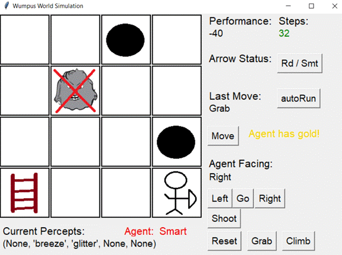<![endif]>

<o:p>&nbsp;</o:p>

<!--[if gte vml 1]><v:shape
 id="image14.png" o:spid="_x0000_i1043" type="#_x0000_t75" style='width:351pt;
 height:258pt;visibility:visible;mso-wrap-style:square'>
 <v:imagedata src="readme_images/image007.png" o:title=""/>
</v:shape><![endif]--><![if !vml]>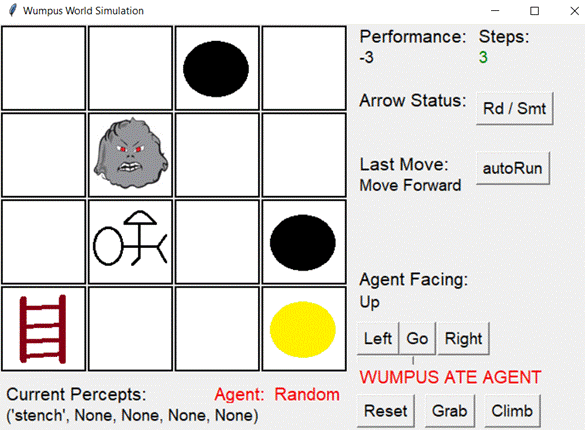<![endif]>

 

<o:p>&nbsp;</o:p>

Figure 3 Result of contrast group 2

<o:p>&nbsp;</o:p>

<!--[if gte vml 1]><v:shape
 id="image10.png" o:spid="_x0000_i1042" type="#_x0000_t75" style='width:348pt;
 height:258.6pt;visibility:visible;mso-wrap-style:square'>
 <v:imagedata src="readme_images/image009.png" o:title=""/>
</v:shape><![endif]--><![if !vml]>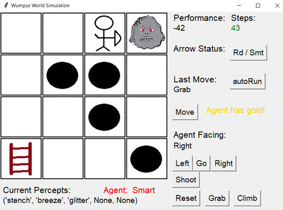<![endif]>

<o:p>&nbsp;</o:p>

<!--[if gte vml 1]><v:shape
 id="image19.png" o:spid="_x0000_i1041" type="#_x0000_t75" style='width:349.2pt;
 height:264pt;visibility:visible;mso-wrap-style:square'>
 <v:imagedata src="readme_images/image011.png" o:title=""/>
</v:shape><![endif]--><![if !vml]>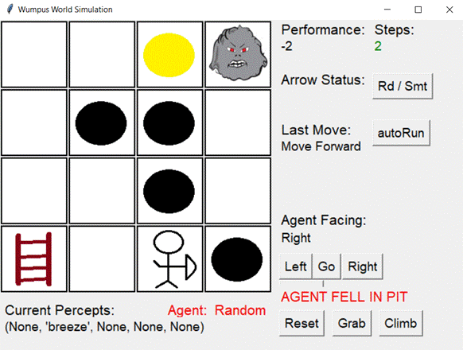<![endif]>

<o:p>&nbsp;</o:p>

<o:p>&nbsp;</o:p>

 

<o:p>&nbsp;</o:p>

Figure 4  Result of contrast group 3

<!--[if gte vml 1]><v:shape
 id="image13.png" o:spid="_x0000_i1040" type="#_x0000_t75" style='width:340.8pt;
 height:250.8pt;visibility:visible;mso-wrap-style:square'>
 <v:imagedata src="readme_images/image013.png" o:title=""/>
</v:shape><![endif]--><![if !vml]>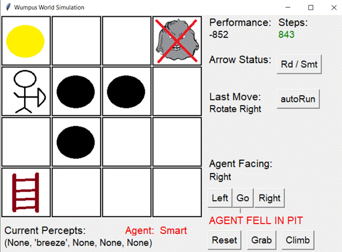<![endif]>

<o:p>&nbsp;</o:p>

<!--[if gte vml 1]><v:shape
 id="image8.png" o:spid="_x0000_i1039" type="#_x0000_t75" style='width:347.4pt;
 height:258.6pt;visibility:visible;mso-wrap-style:square'>
 <v:imagedata src="readme_images/image015.png" o:title=""/>
</v:shape><![endif]--><![if !vml]>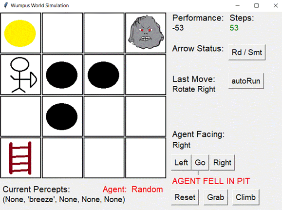<![endif]> 

Figure 5  Result of contrast group 4

<o:p>&nbsp;</o:p>

<!--[if gte vml 1]><v:shape
 id="image5.png" o:spid="_x0000_i1038" type="#_x0000_t75" style='width:346.2pt;
 height:258pt;visibility:visible;mso-wrap-style:square'>
 <v:imagedata src="readme_images/image017.png" o:title=""/>
</v:shape><![endif]--><![if !vml]>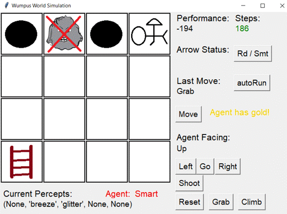<![endif]>

<o:p>&nbsp;</o:p>

<!--[if gte vml 1]><v:shape
 id="image3.png" o:spid="_x0000_i1037" type="#_x0000_t75" style='width:348.6pt;
 height:260.4pt;visibility:visible;mso-wrap-style:square'>
 <v:imagedata src="readme_images/image019.png" o:title=""/>
</v:shape><![endif]--><![if !vml]>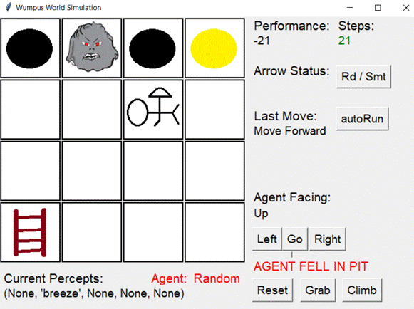<![endif]>

<o:p>&nbsp;</o:p>

 

<o:p>&nbsp;</o:p>

Figure 6 Result of contrast group 5

<o:p>&nbsp;</o:p>

<!--[if gte vml 1]><v:shape
 id="image21.png" o:spid="_x0000_i1036" type="#_x0000_t75" style='width:348.6pt;
 height:256.8pt;visibility:visible;mso-wrap-style:square'>
 <v:imagedata src="readme_images/image021.png" o:title=""/>
</v:shape><![endif]--><![if !vml]>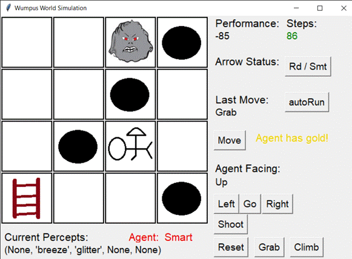<![endif]>

<o:p>&nbsp;</o:p>

<!--[if gte vml 1]><v:shape
 id="image11.png" o:spid="_x0000_i1035" type="#_x0000_t75" style='width:351pt;
 height:258.6pt;visibility:visible;mso-wrap-style:square'>
 <v:imagedata src="readme_images/image023.png" o:title=""/>
</v:shape><![endif]--><![if !vml]>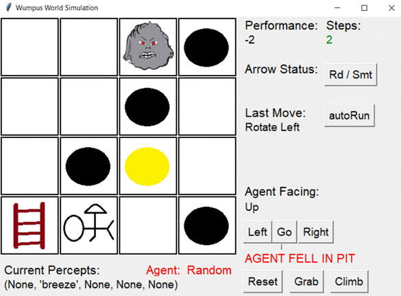<![endif]> 
<o:p></o:p>

Figure 7 Result of contrast group 6

<!--[if gte vml 1]><v:shape
 id="image7.png" o:spid="_x0000_i1034" type="#_x0000_t75" style='width:351.6pt;
 height:257.4pt;visibility:visible;mso-wrap-style:square'>
 <v:imagedata src="readme_images/image025.png" o:title=""/>
</v:shape><![endif]--><![if !vml]>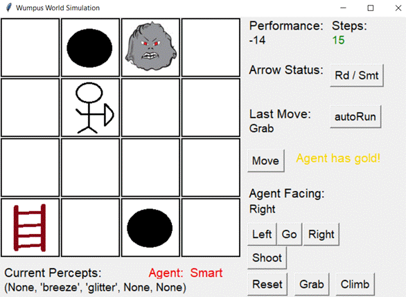<![endif]>

<!--[if gte vml 1]><v:shape
 id="image2.png" o:spid="_x0000_i1033" type="#_x0000_t75" style='width:348pt;
 height:260.4pt;visibility:visible;mso-wrap-style:square'>
 <v:imagedata src="readme_images/image027.png" o:title=""/>
</v:shape><![endif]--><![if !vml]>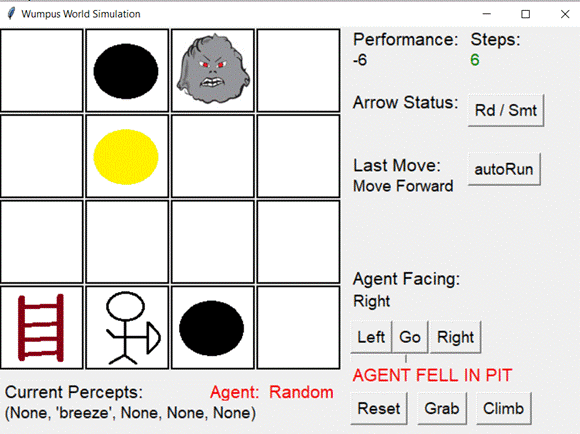<![endif]>

<o:p>&nbsp;</o:p>

<o:p>&nbsp;</o:p>

 

<o:p>&nbsp;</o:p>

Figure 8 Result of contrast group 7

<o:p>&nbsp;</o:p>

<!--[if gte vml 1]><v:shape
 id="image12.png" o:spid="_x0000_i1032" type="#_x0000_t75" style='width:355.2pt;
 height:263.4pt;visibility:visible;mso-wrap-style:square'>
 <v:imagedata src="readme_images/image029.png" o:title=""/>
</v:shape><![endif]--><![if !vml]>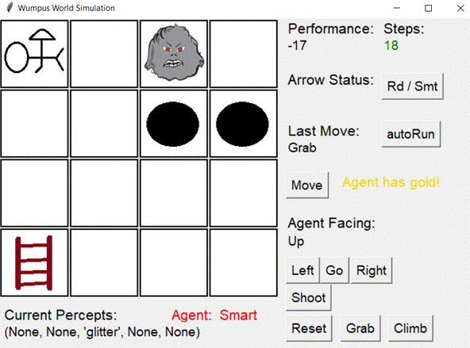<![endif]>

<o:p>&nbsp;</o:p>

<!--[if gte vml 1]><v:shape
 id="image4.png" o:spid="_x0000_i1031" type="#_x0000_t75" style='width:356.4pt;
 height:264.6pt;visibility:visible;mso-wrap-style:square'>
 <v:imagedata src="readme_images/image031.png" o:title=""/>
</v:shape><![endif]--><![if !vml]>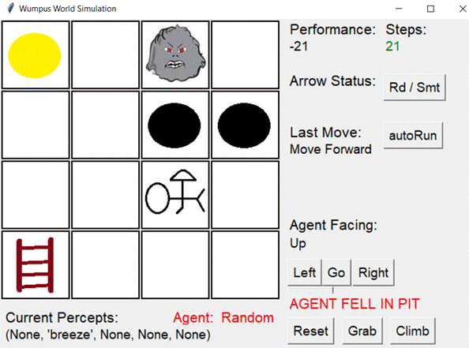<![endif]>

 

<o:p>&nbsp;</o:p>

Figure 9  Result of contrast group 8

<o:p>&nbsp;</o:p>

<!--[if gte vml 1]><v:shape
 id="image16.png" o:spid="_x0000_i1030" type="#_x0000_t75" style='width:364.2pt;
 height:264pt;visibility:visible;mso-wrap-style:square'>
 <v:imagedata src="readme_images/image033.png" o:title=""/>
</v:shape><![endif]--><![if !vml]>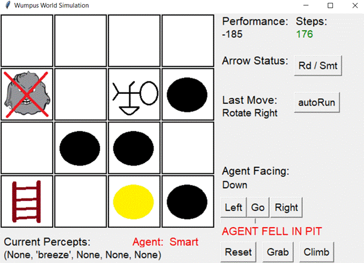<![endif]>

<o:p>&nbsp;</o:p>

<!--[if gte vml 1]><v:shape
 id="image18.png" o:spid="_x0000_i1029" type="#_x0000_t75" style='width:357pt;
 height:263.4pt;visibility:visible;mso-wrap-style:square'>
 <v:imagedata src="readme_images/image035.png" o:title=""/>
</v:shape><![endif]--><![if !vml]>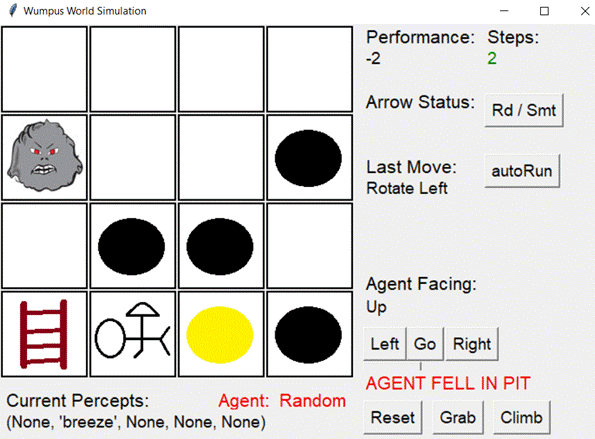<![endif]>

 

<o:p>&nbsp;</o:p>

Figure 10  Result of contrast group 9

<!--[if gte vml 1]><v:shape
 id="image15.png" o:spid="_x0000_i1028" type="#_x0000_t75" style='width:355.8pt;
 height:266.4pt;visibility:visible;mso-wrap-style:square'>
 <v:imagedata src="readme_images/image037.png" o:title=""/>
</v:shape><![endif]--><![if !vml]>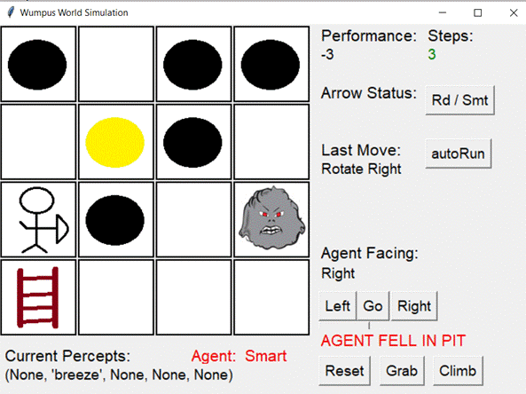<![endif]>

<o:p>&nbsp;</o:p>

<!--[if gte vml 1]><v:shape
 id="image1.png" o:spid="_x0000_i1027" type="#_x0000_t75" style='width:351.6pt;
 height:257.4pt;visibility:visible;mso-wrap-style:square'>
 <v:imagedata src="readme_images/image039.png" o:title=""/>
</v:shape><![endif]--><![if !vml]>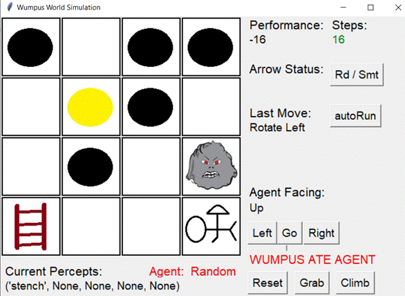<![endif]>

<o:p>&nbsp;</o:p>

 

<o:p>&nbsp;</o:p>

Figure 11  Result of contrast group 10

<!--[if gte vml 1]><v:shape
 id="image20.png" o:spid="_x0000_i1026" type="#_x0000_t75" style='width:354pt;
 height:263.4pt;visibility:visible;mso-wrap-style:square'>
 <v:imagedata src="readme_images/image041.png" o:title=""/>
</v:shape><![endif]--><![if !vml]>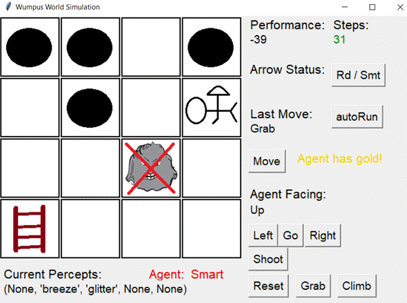<![endif]>

<o:p>&nbsp;</o:p>

<!--[if gte vml 1]><v:shape
 id="image9.png" o:spid="_x0000_i1025" type="#_x0000_t75" style='width:357pt;
 height:262.8pt;visibility:visible;mso-wrap-style:square'>
 <v:imagedata src="readme_images/image043.png" o:title=""/>
</v:shape><![endif]--><![if !vml]>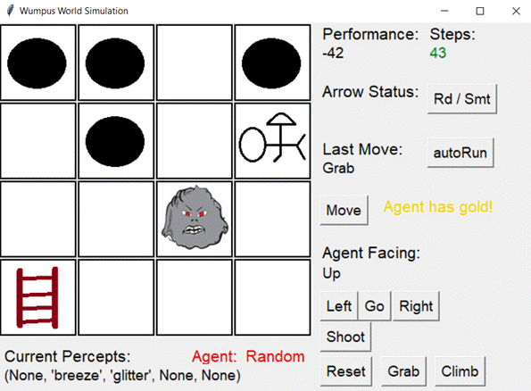<![endif]>

<o:p>&nbsp;</o:p>

<o:p>&nbsp;</o:p>

<o:p>&nbsp;</o:p>

<h1>4. Extra Work</h1>

    

<b style='mso-bidi-font-weight:
normal'>This code could work well with the original
wwsim.py unchanged</b>.

However, it’s very difficult to compare the
two agents in the same scenarios with the original wwsim.py.

In order to observe, debug and compare the two
agents in the same scenarios, a modified wwsim.py is also supplied though it
isn't necessary and demanded. <b style='mso-bidi-font-weight:
normal'>It could be ignored if the wwsim.py is demanded unchanged</b><b
style='mso-bidi-font-weight:normal'>.<o:p></o:p></b>

In the nonGUI mode
of the modified wwsim.py, a timer is added. In the GUI mode, a steps counter
and two buttons of  “Rd/Smt” (switch between random and rational(smart) agents) and
&quot;autoRun&quot; (move 500 steps
automatically)  are added. Running the
new wwsim.py and the new wwagent.py makes the comparison very easy.

If the “autoRun”
button is clicked, the agent would go at most 500 steps ( 500
is a default value, of course it could be reset in the code). The game ends
before 500 steps if the agent wins or fails in advance. If the game doesn’t end
after 500 steps, the button could be clicked again and try another 500 steps
continuously. 

<o:p>&nbsp;</o:p>

<o:p>&nbsp;</o:p>

